# Sam's Portfolio

## Description

This project has been created as a draft of my portfolio. It is version 1; designed to test my html, css, and Bootstrap skills. 
The intention of my Portfolio is to showcase my reecent acheivements and quality of work to prospective employers, but also demonstrate my ability and skills to people looking at the web page. It is designed to be an online CV/ Porfolio. 

I have used the Usage section of this  README to define the problems I encountered from the point at which I asked for help from my online tutor; and the methods used to overcome them. 
The Problems this has solved are: 

I have been able to develope and learn more complicated css, practise the use of predefinned css and isolate elements within the coding to add my own personality and style. I have specifically learnt how to combine methods to create a tabbed navigation system with the use of both images and words as toggleable prompts for different information to show as and when called for.

It has tested my troubleshooting abilities and problem-solving capabilities, although I have had to ask for help to refine and define better methods to acheive the result I was chasing. This has helped me to furhter understand where I need to continue to study, and where I can smooth out my code for future drafts and other webpages. 

My project stands out using navigation methods throughout the website, not just confined to the Nav Bar. 

## Contents 

* Installation 
* Usage
    * Index Page
    * Contact Page
    * Fashion Page
    * Building Page
* Update
* Credits
* License 

## Installation

The major frame work that I have utilised for this project is Bootstrap. 

## Usage

This Project has two stages.
* [My Portfolio](https://samwakelam.github.io/02-RESPONSIVE-PORTFOLIO-SLW/update-Nov/index.html).

* [My first attempt](https://samwakelam.github.io/02-RESPONSIVE-PORTFOLIO-SLW/).

Below you will see laid out my readme from the second week of the course where our task was to create a responsive portfolio. This has been left in to demonstrate the use of multiple html and my progress to this point. 

Please find the Update section for information on my second portfolio and the improved image useage. 

 ### Index Page
 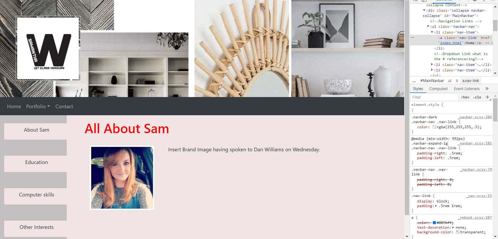

Im pretty happy with this one in general, my side tabs are pretty cool, I used .tab-pane to get it to flick through. Some parts need to be styled, and that's my overall frustration is how to target and override the bootstrap stuff. 
I'm not sure how to isolate the features, I'm trying to use DEV tools to identify the classes and elements. I seem to be struggling to change the colour of the Navbar. 
 This however is not my immediate priority. 

The tabs on the side; the issue is getting them to compress with the page as I shrink it, this is a media queries thing. I have not investigated that too far at this stage of development, just fighting to get the page to work.

 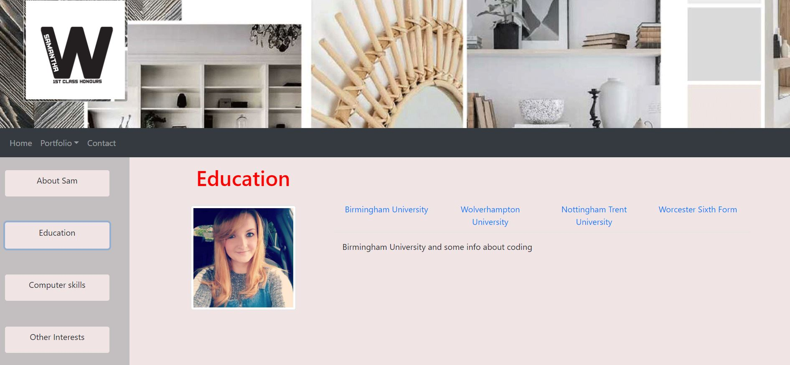

 This I am pleased with. I would like to style the tabs if I have time. I need to focus on Media Quiries first.

 

 Shown for the purpose of a milestone at this point in time. (23.09.2020)

 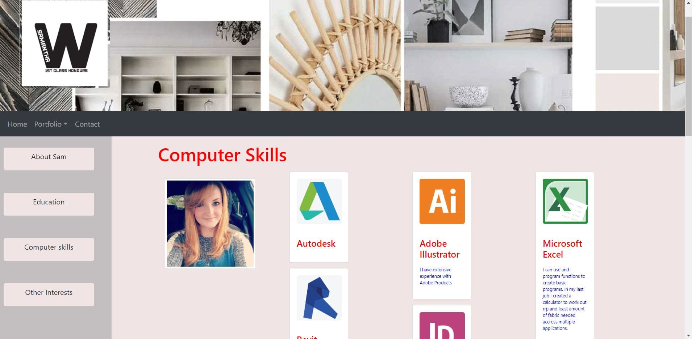

I cannot get the cards to "fall nicely", again having issues keeping the pictures in the containers, I feel like I have forced this page rather than understanding the right way to do this. (desperately trying to ignore design too much at this stage) I have got it to spread evenly in three far spread columns. 

 ### Contact Page 
 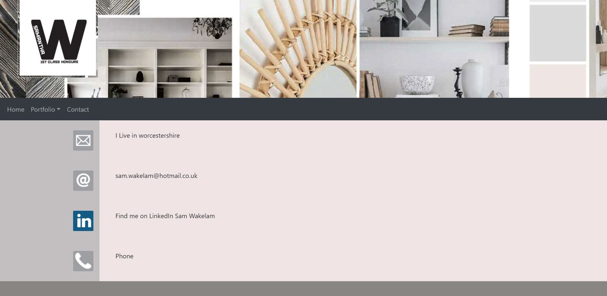

 1.	On the surface this looks okay (if not kind of boring) but again feel like it is a forced hopeful rather than actually working....

2.	I want to reduce the margin I think between the buttons, in theory a simple task, but in reality it took me ages to replicate that with the paragraph tags in the main body, using the same instructions for the div containers, but they don't seem to want to keep the shapes and sizes I give them.  Somehow, I stumbled on the solution to this, I do not feel like it is right and consequently do not want to change it.

(Update 27.09.2020 - I have reduced the padding around the tiles and paragraph, all worked as expected so who knows what I managed to do the first time.)   
      

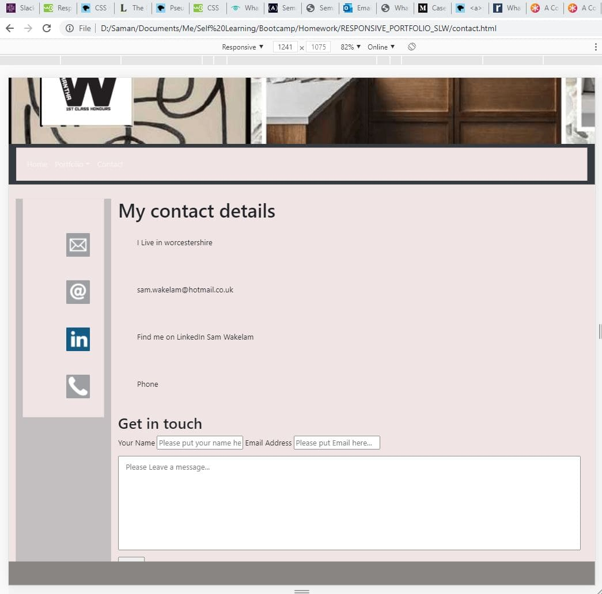   
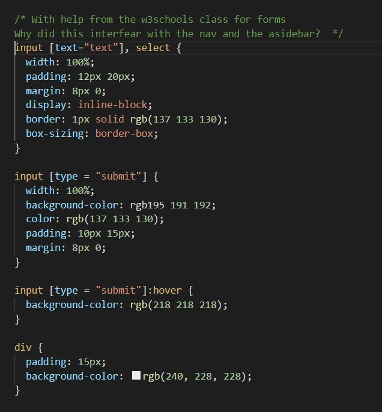   
I have managed to change the little buttons padding etc, as you would expect. It all seems to be as you would expect, so I am not sure what I created in the first instance. 

I have fixed the footer to the bottom of the screen, but not without faults, the rest of the content does not follow it. and some of the content does not scoll above it. 

(Update 27.09.2020 - this was fixed by taking out the bootstrap and using position relative, however the footer still floats in mid air if the content is not long enough for the screen)

As you can see the form css has interfeared with the aside and nav bar. i have left comments in the css here. I resolved this by targeting the form input attribute selectors only. 

(Update 27.09.2020 - added some bootstrap to the form to make it much nicer.)

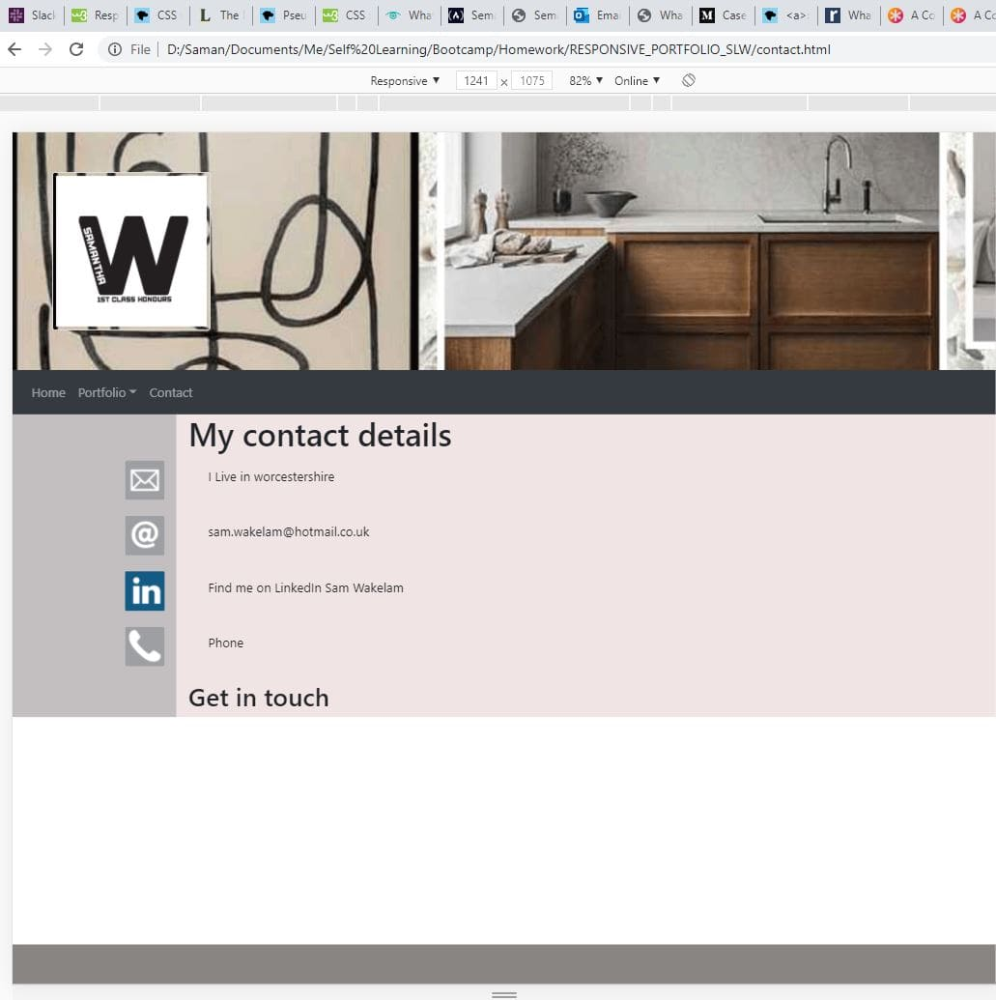
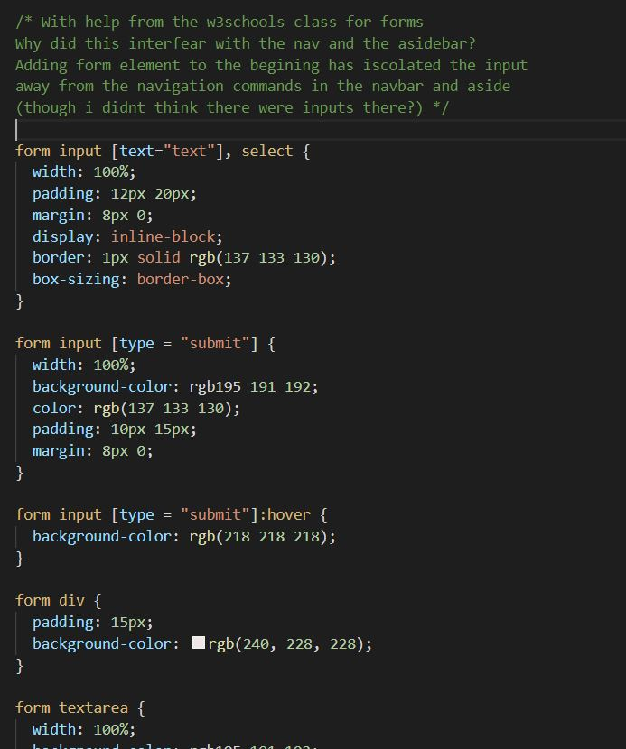

Next problem, the form doesnt scroll all the way past the footer.... 

(Update 27.09.2020 - this was fixed by taking out the bootstrap and using position relative, however the footer still floats in mid air if the content is not long enough for the screen)

 ### Fashion Page
 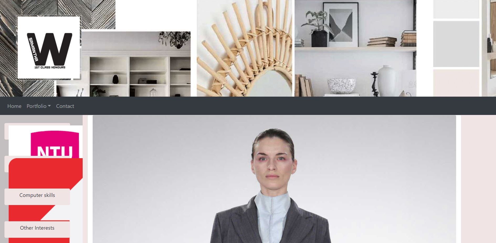

This one is a nightmare.

The aside, I am trying to replicate what I did in index with the side tabs, but with logos like in contact.

I am either struggling to get floats and blocks to work and not have everything cluster together, or the pictures will not go into the containers, or I can’t put a nav-panes instruction to it.

The cards, either squash the photos, or are massive on the page and I have tried CSS and class and id to try and "force it" but for some reason whatever I try is just messing up and I’m losing patience with it. I just do not seem to understand why it is not doing what I think I am telling it. It does not seem to follow any logic patterns at all.

(Update 27.09.2020 - While I have not amended this in time for the homework, I ahve been reading about sizing today, I think i have tried to use the wrong units for the hights and widths. I am to revisit this soon. It is a missunderstanding of inherited assets from the containers and img elemennts i belieive.)

 ### Building Page
 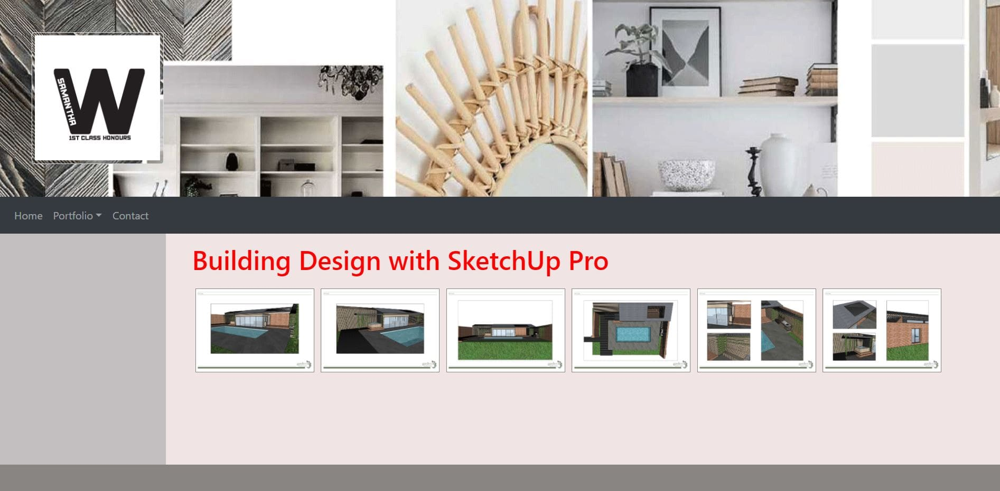

This Page I completed having researched CSS image gallery, as an alternative to the cards as a presentation. I needed to demonstrate Bootstrap but also I wanted to test some other theories. This seems to have gone to plan. 

(Update 27.09.2020 - There is an odd flickering effect if I increase the :hover to 2px boarder. Described in notes in HTML and CSS, I believe it is a magin padding and box-size issuse, but I am not sure where to target.)

## Update

(Update 11.11.2020) - Having spent 6 weeks intense learning on the course I feel alot more confident with CSS, images and general layout. 

looking back at my work from week 2 I know I can do better ... and so I have. 

Part of the requirments was to have a seperate contact page. i have purposfully left this out of this version as there was not enough content to produce an interesting page. 

There are a number of links to parts on the page including the contact section which is more relevant in a smaller screen size. 

There are a number of responsive layouts for different sizes to best fill the screen. 

My design is based around a news bulliten or artical layout with the large titles and blocks of text. It is a design portfolio and so images are crutial. 

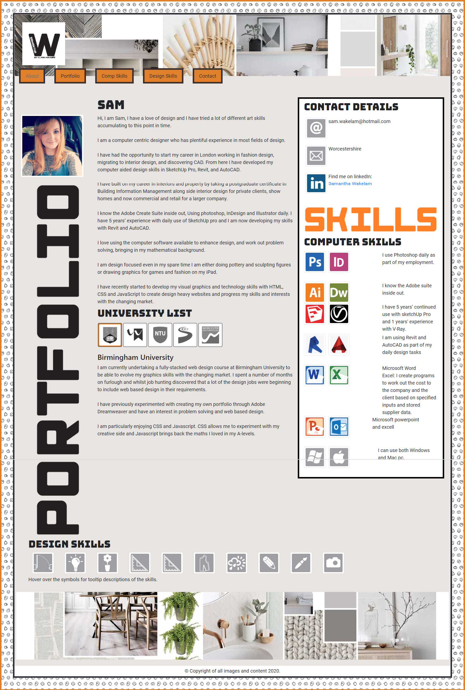

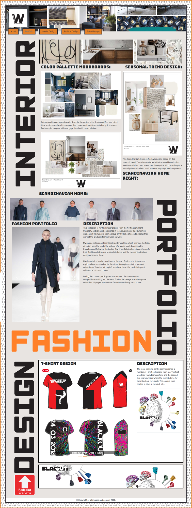

## Credits 

Thanks need to go to Colum Lynagh again for helping to refine my code and iron out the issues I was having. 

The resources I have refered to while using this page have been 
W3Schools.com
getBootstrap.com 
imagecompressor.com
meyerweb.com

## License

All images in this project are Copyright 2020 to Samantha Wakelam, or other companies whoes branding is shown and may not be used by anyone without express permission from the owners. 
